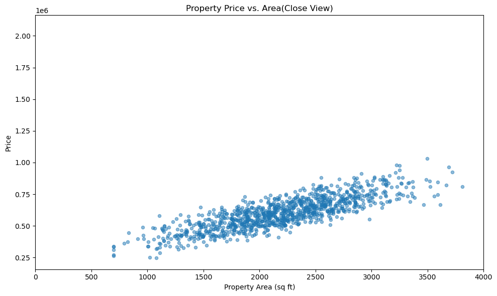
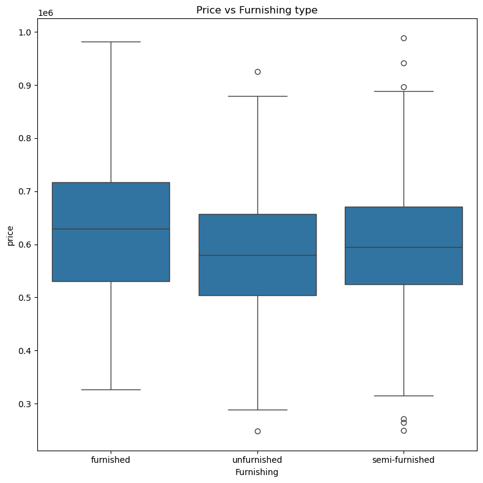
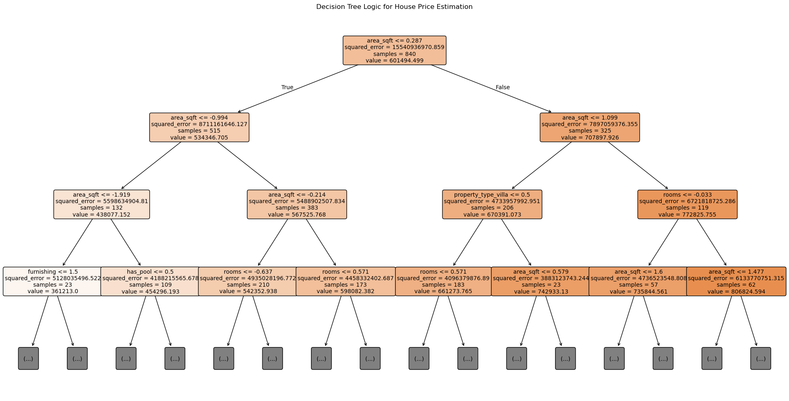

# house-price-prediction
End-to-end house price prediction pipeline in Python. Features data preprocessing (imputation, encoding, outlier removal), statistical EDA to extract market trends, and predictive Machine Learning regression modeling to accurately forecast property values.

# Objective
The goal of this project is to build an end-to-end data science pipeline that analyzes urban housing market dynamics and predicts residential property values. By leveraging Pandas for rigorous data preprocessing and Exploratory Data Analysis (EDA), the project aims to uncover the primary structural and environmental drivers behind real estate pricing. Ultimately, these insights are used to train, evaluate, and optimize predictive Machine Learning regression models capable of forecasting property values with high accuracy.

# Data Cleaning
1. Standardized column names and data types across the dataset.
2. Handled missing data via targeted row deletion and logical feature imputation.
3. Encoded text-based categorical variables into proper boolean types.
4. Isolated column-wise statistical outliers and purged duplicate records.

# Exploratory Data Analysis (EDA)
### Univariate Analysis: 
This section analyzes individual variables, showing that apartments are the most common property type and that core pricing is heavily clustered between 550,000 and 650,000. It also identifies a distinct construction boom over the last decade alongside a dominant market share of semi-furnished homes.

### Bivariate Analysis: 
This step explores direct correlations between independent features and property prices to isolate core standard behaviors. Key findings highlight diminishing returns for properties exceeding 4 rooms, prompting a data pre-processing cap at $1,000,000 to isolate regular consumers from luxury noise.

### Multivariate Analysis: 
This section expands into multi-variable interactions alongside pricing to build a enhanced market evaluation. The results show a highly dense price band between 300,000 and 850,000, and reveal that a property’s age does not strongly dictate its final price.

# Machine Learning
### Data Pre-processing & Feature Engineering
* Categorical features were converted via one-hot encoding, while continuous variables were scaled using `StandardScaler` to ensure uniform weighting.
* Extremely high-end structural anomalies were filtered out, and a new `house_age` feature was engineered to optimize prediction accuracy.

### Model Training & Evaluation
* Three regression models—Multiple Linear Regression, K-Nearest Neighbors (KNN), and a Decision Tree Regressor—were built and benchmarked.
* Multiple Linear Regression proved to be the most robust architecture, yielding an outstanding $R^2$ score of 0.9769 and a tight error threshold.

## Key Insights & Actionable Buyer Decisions

Understanding the underlying drivers of property values can mean the difference between overpaying for an asset and securing a high-yield home. Based on a rigorous exploration of the property dataset—ranging from individual feature distributions to advanced linear modeling—here are 10 key market insights designed to help buyers make data-driven, strategic purchasing decisions.

---

### I. Property Dimensions & Spatial Dynamics

#### 1. Square Footage: The Ultimate Price Multiplier
* **Insight:** There is an exceptionally robust positive linear correlation (correlation coefficient = 0.86) between property area and final price[cite: 2]. Furthermore, machine learning decision-tree models pick square footage as the absolute root node for segmenting property values[cite: 4].
* **Buyer Decision:** Prioritize functional layouts over sheer size. Because square footage acts as the primary price accelerator, reducing unnecessary space by even 100–200 square feet can drastically lower your baseline purchasing cost without sacrificing lifestyle utility.

#### 2. Identifying the Market "Sweet Spot"
* **Insight:** The mass volume of the residential market occupies a clear density cluster between 500 and 4,000 square feet, centering cleanly around a median of 2,200 square feet[cite: 1, 3].
* **Buyer Decision:** If you are focused on long-term resale liquidity and ease of future financing, target properties near this **2,200 sq ft gold standard**[cite: 1]. Homes in this bracket represent the highest demand pool, protecting you against future market stagnation.

#### 3. Hidden Premiums in Mid-Sized Homes
* **Insight:** For properties measuring between 1,600 and 2,600 square feet, prices display massive vertical variance on scatter plots[cite: 3]. This means that homes with identical square footage in this specific bracket frequently sell for vastly different prices[cite: 3].
* **Buyer Decision:** When shopping within the popular 1,600–2,600 sq ft range, do not accept a high price purely based on size[cite: 3]. Dig deeper into localized features (such as pool presence or layout utility) to find under-priced anomalies hidden within this volatile segment[cite: 3].

---

### II. Room Architecture & Property Typologies

#### 4. The 4-Room Equilibrium
* **Insight:** While properties range across the board from 2 to 7 rooms, 4-room configurations stand out as the established market standard and the most common selection[cite: 1]. Price scales up predictably until the 4-room mark, after which the distribution curve flattens significantly[cite: 3].
* **Buyer Decision:** Opt for a **4-room layout** to secure the highest marginal return on value[cite: 1]. Paying an extra premium for 5 to 7 rooms yields diminishing returns unless you explicitly require high-capacity rooms for immediate family utility[cite: 3].

#### 5. Navigating Property Type Hierarchies
* **Insight:** Property type establishes a strict pricing structure across the database[cite: 3]. Apartments remain the most economical option, while duplexes and independent houses share a matching mid-tier price distribution[cite: 3]. Luxury villas predictably command the highest market premiums[cite: 3].

| Property Type | Pricing Tier | Market Presence |
| :--- | :--- | :--- |
| **Apartment** | Budget-Friendly / Entry-Level[cite: 3] | Absolute Majority Share[cite: 1] |
| **Duplex / Independent House** | Mid-Tier Baseline[cite: 3] | Secondary Market Segment[cite: 1] |
| **Villa** | Premium / Luxury[cite: 3] | Lowest Volume / Elite[cite: 1] |

* **Buyer Decision:** If you are budget-conscious, default strictly to apartments[cite: 3]. If you are looking at independent houses, check competing duplexes—they share the exact same pricing baseline but may offer superior layout configurations or yard space[cite: 3].

---

### III. Aesthetic, Amenity, and Location Influences

#### 6. The "Semi-Furnished" Valuation Trap
* **Insight:** The data reveals that semi-furnished properties track almost identically to unfurnished properties in terms of baseline price averages[cite: 3]. Conversely, fully furnished units command an immediate, unmistakable price premium across the entire market[cite: 3].
* **Buyer Decision:** Do not pay an upscale premium for a "semi-furnished" listing, as the broader market values it similarly to an empty shell[cite: 3]. Either purchase an **unfurnished property** to minimize upfront loan costs or go for a **fully furnished property** to guarantee a tangible luxury return on investment[cite: 3].

#### 7. Setting the Floor via Street Types
* **Insight:** Gated societies create a premium, unshakeable price floor across all listings, whereas traditional residential lanes offer the lowest barriers to entry[cite: 3]. Mid-tier street types—including main roads, corner plots, and highway-facing properties—share highly competitive and overlapping price bands[cite: 3].
* **Buyer Decision:** For long-term asset security, look into a gated society to leverage its built-in value protection[cite: 3]. If maximizing affordability is your primary goal, bypass main roads and corner plots entirely and focus exclusively on residential lanes[cite: 3].

#### 8. Capitalizing on Recent Build Supply
* **Insight:** Properties built across the historical timeline show a consistent distribution, but there is a sharp construction surge within the last 10 years[cite: 1].
* **Buyer Decision:** This supply spike gives buyers strong negotiating leverage on newer builds. Target homes constructed within the last decade to secure modern infrastructure and energy-efficient designs without overpaying for an inflated "scarcity" factor[cite: 1].

---

### IV. Valuation Intelligence & Predictive Analytics

#### 9. Filtering Out the Luxury Estate Noise
* **Insight:** Properties priced over $1,000,000 represent statistical noise, accounting for only 9 extreme listings out of the entire database[cite: 4]. Standard residential properties remain heavily concentrated in a stable price band between $250,000 and $1,000,000[cite: 1, 4].
* **Buyer Decision:** If you are a standard homebuyer, entirely exclude properties over $1,000,000 from your comparative market analysis[cite: 4]. Doing so removes high-end pricing distortions and lets you evaluate fair market values based on predictable consumer trends[cite: 4].

#### 10. High Predictive Certainty for Fair Bidding
* **Insight:** Advanced multivariate machine learning algorithms (Multiple Linear Regression) predict property values with an exceptional accuracy rate (R² = 0.9769) based purely on size, rooms, age, and location[cite: 4].
* **Buyer Decision:** Real estate pricing in this market is highly logical and mathematically consistent, not arbitrary[cite: 4]. Before submitting an offer, use these core baseline metrics (Area, Rooms, Age, Location) to construct a strict valuation framework and avoid bidding on emotionally over-priced listings[cite: 4].

# Images
### Price vs Property Area

* A scatter plot demonstrating the strong positive linear correlation between a property's total square footage and its final sale price, specifically focusing on the highest density market segment below 4,000 square feet.
---
### Price vs Furnishing Type

* A box plot analyzing the variance and spread of property values based on furnishing status, highlighting the notable market value premium commanded by fully furnished units over semi-furnished or empty homes.

### Decision Tree

* A visual breakdown of the trained Decision Tree Regressor model, mapping out the precise conditional logic, feature hierarchy (prioritizing property area), and valuation pathways used to estimate house prices.
